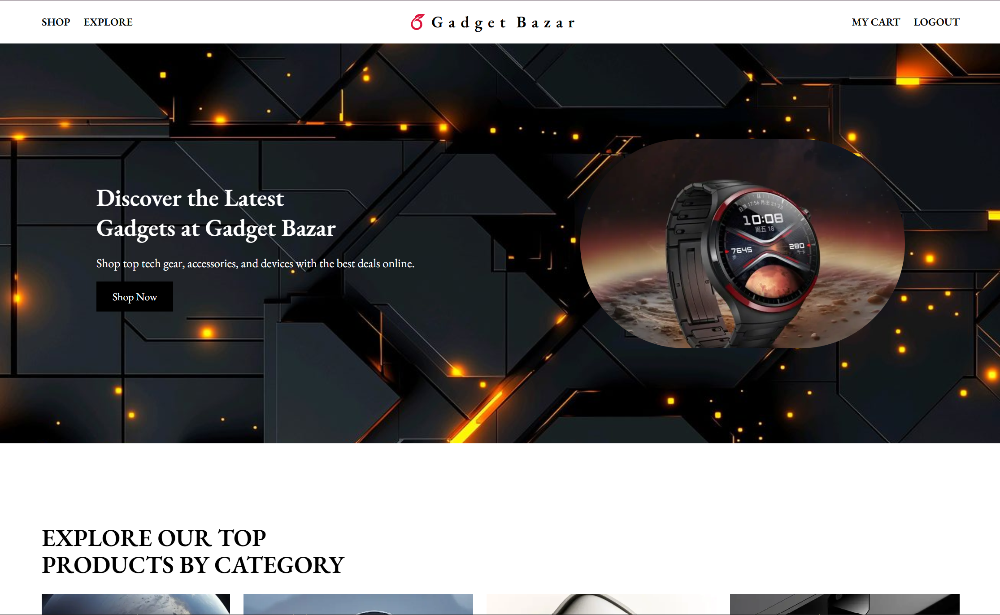

<!-- This is a [Next.js](https://nextjs.org) eCommerse project [`create-next-app`](https://github.com/vercel/next.js/tree/canary/packages/create-next-app).

## Currently working on it...

🔗 Live Site: [Gadget Bazar](https://gadget-bazar-pi.vercel.app/)

## Deploy on Vercel -->

# 🛒 Gadget Bazar

Discover the latest gadgets at **Gadget Bazar** – your one-stop online shop for smart devices, wearables, and electronics.  
This project is built with **Next.js** and includes **NextAuth.js authentication**, a clean UI, and powerful eCommerce features.

---

## 🚀 Live Site
👉 [Visit Gadget Bazar Live site](https://gadget-bazar-pi.vercel.app/)  

---

## ✨ Features

- 🔐 **Authentication & Authorization** with NextAuth.js (Login, Register)
- 🛍️ **Product Browsing** by category & search  
- 🛒 **Cart & Checkout**  
- 🛠️ **Admin Dashboard** to manage products & users  
<!-- - 🎨 **Responsive UI** with Tailwind CSS  
- 🌗 **Theme Toggle** (Dark/Light mode)   -->

---

## 🛠️ Tech Stack

- **Framework**: [Next.js 15+](https://nextjs.org/)  
- **Styling**: [Tailwind CSS](https://tailwindcss.com/)  
- **Authentication**: [NextAuth.js](https://next-auth.js.org/)  
- **Database**: MongoDB (without Mongoose)  
- **API Requests**: Axios  
- **UI Components**: custom components  
- **Deployment**: Vercel  

---

## 👨‍💻 Author

Rashik
💼 Frontend Developer | Passionate about building modern web apps

GitHub: @your-username

LinkedIn: Your Profile
